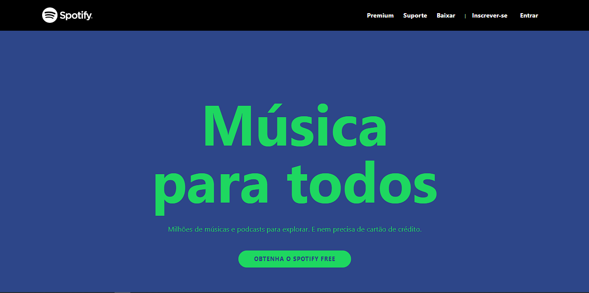
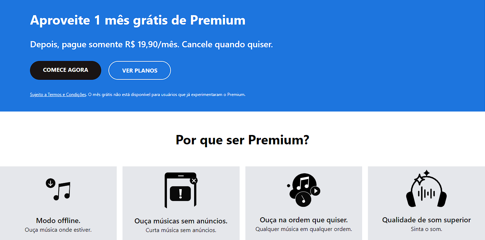
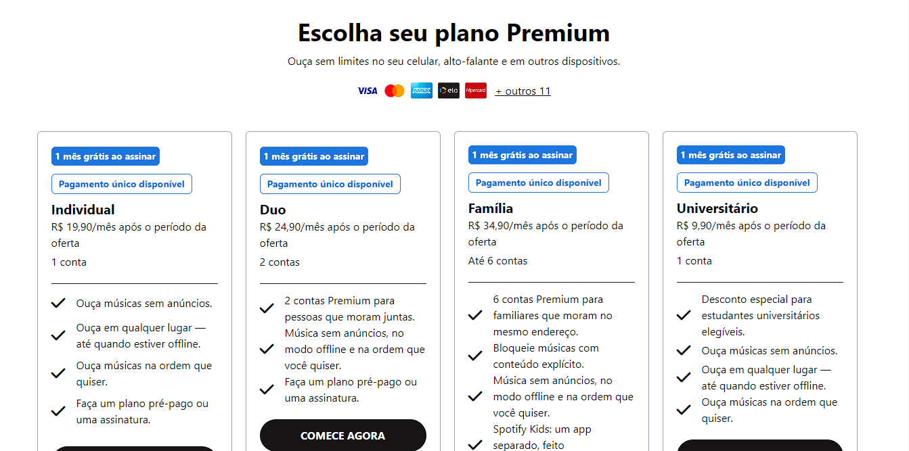
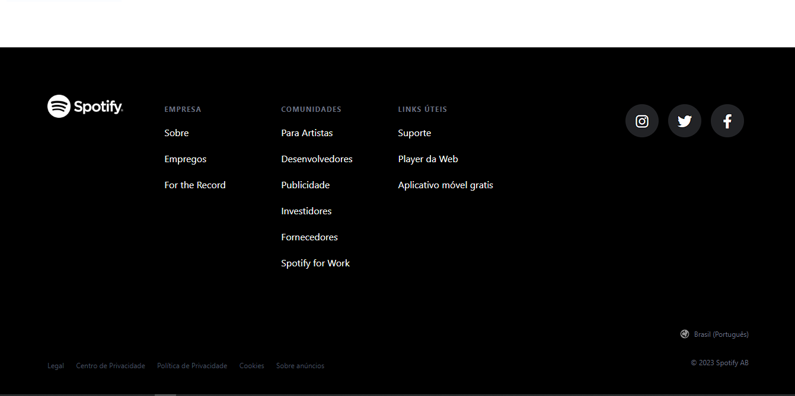

# Spotify :musical_note:

## Descrição :page_with_curl:
Este projeto é um clone da página inicial do Spotify, desenvolvido para treinar o uso do Tailwind CSS e aprimorar habilidades de design e desenvolvimento front-end. :books:   O objetivo foi replicar a aparência e algumas funcionalidades básicas do Spotify original.   
Veja abaixo algumas de suas características:
- Layout responsivo que se adapta a diferentes tamanhos de tela e dispositivos.
- Estilo e design semelhantes à página inicial do Spotify original.
- Utilização do Tailwind CSS para estilização e organização do código.

***
## Como acessar o site? :computer:

Para acessar o site **[clique aqui](https://gui-bus.github.io/cloneSpotify/)**.

***

## Tecnologias utilizadas :dart:

 
  
  
  
 

***

## Contribuição :bulb:
Gostaria de contribuir para o projeto? Fico muito grato pelo interesse!
- Sinta-se à vontade para entrar em contato comigo através das minhas redes sociais para enviar suas mensagens, sugestões ou comentários sobre o projeto.

***

## Fontes e agracimentos :handshake:
Gostaria de expressar minha gratidão às seguintes fontes por sua contribuição para a criação deste projeto:
- Ao **[Spotify](https://www.spotify.com/br-pt/premium/)** por fornecer uma ótima referência visual e inspiração para este projeto de clone.   
- Ao professor **[Matheus Battisti](https://www.instagram.com/horadecodar/)** por fornecer os ensinamentos sobre Tailwind CSS.
Muito obrigado! :rocket:

***

## Redes sociais para contato! :speech_balloon:

***

## Aviso :warning:
Este projeto é apenas para fins educacionais e não está afiliado ou endossado pelo Spotify. O uso deste projeto é de sua responsabilidade.

**Divirta-se explorando o clone do Spotify!** :musical_note:

